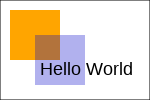

# HTML-Canvas-p6

This a a module for composing and rendering HTML-5 canvases.

It supports the majority of the [HTML Canvas 2D Context](https://www.w3.org/TR/2dcontext/) API.

A canvas may be constructed via the API, then rendered to JavaScript via the `.js` or `.to-html` methods, or saved to a Cairo-supported format such as PNG, SVG or PDF.

The module includes classes:

- `HTML::Canvas`, a Perl 6 implementation of the basic HTML Canvas 2D API.
- `HTML::Canvas::Image` - for image loading in a variety of formats
- `HTML::Canvas::To::Cairo` - a built-in renderer, which can output to several formats,
 including PNG, SVG and PDF.

# Install

This package depends on Font::FreeType, and may also require additional fonts on your system:

- the [freetype](https://www.freetype.org/download.html) native library needs to be on your system prior to installing PDF::FontLoader

- Installation of the [fontconfig](https://www.freedesktop.org/wiki/Software/fontconfig/) package is also currently required.

## Install - Fonts

Fonts are currently found using fontconfig's fc-match utility. For example:

    % fc-match 'arial;weight=bold'
    DejaVuSans.ttf: "DejaVu Sans" "Book"

If fc-match is unable to find a font. HTML::Canvas currently falls back to using a mono-spaced font (FreeMono).

The font may need to be installed on your system and/or fontconfig may
need additional configuration to ensure it finds the correct font.

# Example

```
use v6;
# Create a simple Canvas. Save as PNG and HTML

use HTML::Canvas;
my HTML::Canvas $canvas .= new: :width(150), :height(100);

$canvas.context: -> \ctx {
    ctx.strokeRect(0, 0, 150, 100);
    ctx.save; {
        ctx.fillStyle = "orange";
        ctx.fillRect(10, 10, 50, 50);

        ctx.fillStyle = "rgba(0, 0, 200, 0.3)";
        ctx.fillRect(35, 35, 50, 50);
    }; ctx.restore;

    ctx.font = "18px Arial";
    ctx.fillText("Hello World", 40, 75);
}

# save canvas as PNG
use Cairo;
my Cairo::Image $img = $canvas.image;
$img.write_png: "examples/canvas-demo.png";

# also save canvas as HTML
my $html = "<html><body>{ $canvas.to-html }</body></html>";
"examples/canvas-demo.html".IO.spurt: $html;

```



## Saving as PDF

```
use v6;
use Cairo;
use HTML::Canvas;
use HTML::Canvas::To::Cairo;
# create a 128 X 128 point PDF
my Cairo::Surface::PDF $surface .= create("examples/read-me-example.pdf", 128, 128);

# create a PDF with two pages
# use a common cache for objects shared between pages such as
# fonts and images. This reduces both processing times and PDF file sizes.
my  HTML::Canvas::To::Cairo::Cache $cache .= new;

for 1..2 -> $page {
    my HTML::Canvas $canvas .= new;
    my HTML::Canvas::To::Cairo $feed .= new: :$surface, :$canvas, :$cache;
    $canvas.context({

        .font = "10pt times-roman bold";
        .fillStyle = "blue";
        .strokeStyle = "red";
        .save; {
            .fillStyle = "rgba(1.0, 0.2, 0.2, 0.25)";
            .rect(15, 20, 50, 50);
            .fill;
            .stroke;
        }; .restore;
        .fillText("Page $page/2", 12, 12);
    });
    $surface.show_page;
}

$surface.finish;

```


## Images

The `HTML::Canvas::Image` class is used to upload images for inclusion in HTML documents,
and/or rendering by back-ends.

```
use HTML::Canvas;
use HTML::Canvas::Image;

my HTML::Canvas $canvas .= new;
my @html-body;
# add the image, as a hidden DOM item
my HTML::Canvas::Image \image .= open("t/images/camelia-logo.png");
@html-body.push: HTML::Canvas.to-html: image, :style("visibility:hidden");
# draw it
$canvas.context( -> \ctx {
    ctx.drawImage(image, 10, 10  );  
});

@html-body.push: $canvas.to-html;

my $html = "<html><body>" ~ @html-body.join ~ "</body></html>";

```

`HTML::Canvas::Image` can load a variety of image formats. The built-in
`HTML::Canvas::To::Cairo` renderer only supports PNG images, as below:

Currently supported image formats are:

Back-end                  | PNG | GIF |JPEG | BMP
---                       | --- | --- | --- | ---
`HTML::Canvas (HTML)`     | X   | X   | X   | X
`HTML::Canvas::To::Cairo` | X   |     |     |
`HTML::Canvas::To::PDF`   | X   | X   | X   |


## Methods

The methods below implement the majority of the W3C [HTML Canvas 2D Context](https://www.w3.org/TR/2dcontext/) API.

## Setters/Getters

#### lineWidth

    has Numeric $.lineWidth = 1.0;

#### globalAlpha

    has Numeric $.globalAlpha = 1.0;

#### lineCap

    subset LineCap of Str where 'butt'|'round'|'square';
    has LineCap $.lineCap = 'butt';

#### lineJoin

    subset LineJoin of Str where 'bevel'|'round'|'miter';
    has LineJoin $.lineJoin = 'bevel';

#### font

    has Str $.font = '10pt times-roman';

#### textBaseline

    subset Baseline of Str where 'alphabetic'|'top'|'hanging'|'middle'|'ideographic'|'bottom';
    has Baseline $.textBaseline = 'alphabetic';

#### textAlign

    subset TextAlignment of Str where 'start'|'end'|'left'|'right'|'center';
    has TextAlignment $.textAlign = 'start';

#### direction

    subset TextDirection of Str where 'ltr'|'rtl';
    has TextDirection $.direction = 'ltr';

#### fillStyle

    subset ColorSpec where Str|HTML::Canvas::Gradient|HTML::Canvas::Pattern;
    has ColorSpec $.fillStyle is rw = 'black';

#### strokeStyle

    has ColorSpec $.strokeStyle is rw = 'black';

#### setLineDash/getLineDash/lineDash

     has Numeric @.lineDash;

#### lineDashOffset

      has Numeric $.lineDashOffset = 0.0;

## Graphics State

#### `save()`

#### `restore()`

#### `scale(Numeric $x, Numeric $y)`

#### `rotate(Numeric $rad)`

#### `translate(Numeric $x, Numeric $y)`

#### `transform(Numeric \a, Numeric \b, Numeric \c, Numeric \d, Numeric \e, Numeric \f)`

#### `setTransform(Numeric \a, Numeric \b, Numeric \c, Numeric \d, Numeric \e, Numeric \f)`

## Painting Methods

#### `clearRect(Numeric $x, Numeric $y, Numeric $w, Numeric $h)`

#### `fillRect(Numeric $x, Numeric $y, Numeric $w, Numeric $h)`

#### `strokeRect(Numeric $x, Numeric $y, Numeric $w, Numeric $h)`

#### `beginPath()`

#### `fill()`

#### `stroke()`

#### `clip()`

#### `fillText(Str $text, Numeric $x, Numeric $y, Numeric $max-width?)`

#### `strokeText(Str $text, Numeric $x, Numeric $y, Numeric $max-width?)`

#### `measureText(Str $text)`

## Path Methods

#### `closePath()`

#### `moveTo(Numeric \x, Numeric \y)`

#### `lineTo(Numeric \x, Numeric \y)`

#### `quadraticCurveTo(Numeric \cp1x, Numeric \cp1y, Numeric \x, Numeric \y)`

#### `bezierCurveTo(Numeric \cp1x, Numeric \cp1y, Numeric \cp2x, Numeric \cp2y, Numeric \x, Numeric \y)`

#### `rect(Numeric $x, Numeric $y, Numeric $w, Numeric $h)`

#### `arc(Numeric $x, Numeric $y, Numeric $radius, Numeric $startAngle, Numeric $endAngle, Bool $counterClockwise?)`

## Images Patterns and Gradients

#### drawImage:

    multi method drawImage( $image, Numeric \sx, Numeric \sy, Numeric \sw, Numeric \sh, Numeric \dx, Numeric \dy, Numeric \dw, Numeric \dh);
    multi method drawImage(CanvasOrXObject $image, Numeric $dx, Numeric $dy, Numeric $dw?, Numeric $dh?)

#### `createLinearGradient(Numeric $x0, Numeric $y0, Numeric $x1, Numeric $y1)`

#### `createRadialGradient(Numeric $x0, Numeric $y0, Numeric $r0, Numeric $x1, Numeric $y1, Numeric:D $r1)`

#### `createPattern($image, HTML::Canvas::Pattern::Repetition $repetition = 'repeat')`

Example:

```
use HTML::Canvas;
use HTML::Canvas::Image;

my HTML::Canvas \ctx .= new;
my @html-body;

## Images ##

my HTML::Canvas::Image \image .= open("t/images/crosshair-100x100.jpg");

# save to HTML
@html-body.push: HTML::Canvas.to-html: image, :style("visibility:hidden");
# draw on the canvas
ctx.drawImage(image,  20, 10,  50, 50);

## Patterns ##

my \pat = ctx.createPattern(image,'repeat');
ctx.fillStyle = pat;
ctx.translate(10,50);
ctx.fillRect(10,10,150,100);

## Gradients

with ctx.createRadialGradient(75,50,5,90,60,100) -> $grd {
    $grd.addColorStop(0,"red");
    $grd.addColorStop(0.5,"white");
    $grd.addColorStop(1,"blue");
    ctx.fillStyle = $grd;
    ctx.translate(10,200);
    ctx.fillRect(10, 10, 150, 100);
}

say ctx.js;
```

## Image Data

Currently support for `getImageData` and `putImageData` (3 argument format) only.

#### `getImageData(Numeric sx, Numeric sy, Numeric sw, Numeric sh)`

#### `putImageData(image-data, Numeric dx, Numeric dy)`

## Additional Rendering Backends

- [HTML::Canvas::To::PDF](https://github.com/p6-pdf/HTML-Canvas-To-PDF-p6) - render to PDF, using the Perl 6 [PDF](https://github.com/p6-pdf) tool-chain.
